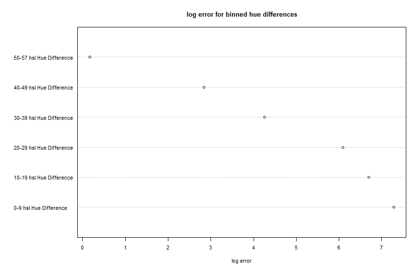

- Working link to the experiment hosted on gh-pages.
- Concise description and screenshot of your experiment.
- Description of the technical achievements you attempted with this project.
- Description of the design achievements you attempted with this project.
[project link](https://kajgohan.github.io/03-Exp-Share/index.html)

# Project Description
## Experimental Design

Our experiment was designed to determine human's ability to distinguish outliers as a result of the popout effect. The experiment focused on the preattentive stage of vision by limiting the amount of time a participant was exposed to the visual stimulus. The project was designed under the assumption that pre-attentive processing occurs, and that the majority of preattentive processing is measured at under 200ms. Our hypothesis that a greater difference in hue would result in more users noticing the popout. 

http://jov.arvojournals.org/article.aspx?articleid=2120544

---
First, we put together a simple instructional page to inform users of their task: 

The goal of this description was to inform the user that they would have a limited time to spot something that was out of place. Because the tests were so short, the users had to be adequately prepared, as the first round starts immediately after the begin button is pressed. 

---
Next, the visualization is flashed to the user:

This page was shown to the quiz participant for 200ms (circle and arrow added to show popout dot). 200ms was chosen because it is the minimum time required to initiate eye movements. This is described in the paper <a href='https://www.cs.ubc.ca/cgi-bin/tr/1993/TR-93-51.pdf'>High-Speed Visual Estimation Using Preattentive Processing</a> by Healy, Booth and Enns. In the same study, outliers are varied in location on screen to prevent subjects from pre-focusing on any one location. Our experiment also varied the location because the same user could participate in an unlimited number of rounds. The number of dots was held constant for each round and trial. The background and popout color were varied in order to test the difference in hue, not simply the difference between one hue and another. The Outlier was added to the scatter plot 50% of the time, this meant that participants guessing randomly would have no advantage from always choosing true or false. This also meant that half of all rounds did not produce meaningful data. The Hue of the background dots and the outlier dot was recorded for each round. Additionally, the location of the outlier dot was recorded. 

---
After the scatter was shown for 2 seconds, the user was directed to the input page. 

On this simple page the participant was asked if they saw a outlier on the previous page. This is a simple yes or no. The user is able to select each radio button using the mouse or with keyboard input. The p and q keys were chosen because the average computer user will use different hands for each key, therefore reducing the possibility of accidental inputs. After making their selection the participants were shown another page of dots with or without an outlier. This process continued until the user chose the end option. Each session was logged with a unique id. 

### Program Design

Our program was designed to be simple and free of distractions. The pages are in 3 HTML files which reference a CSS style sheet. The CSS uses flexbox for some positioning, and animation to make the directions more engaging. The JavaScript file contains the d3, keylogger, and Firebase implementation. First, the d3 uses the random svg method to create the svg with 100 random dots from the sample data variable. The outlier presence is determined using getRandomBool. The outliers presence is also determined in a random range in the canvas. Once the above has been determined, it is saved to local storage. After 200ms the page moves to the response page. On this page the keylistener logs all keystrokes and calls the choice handler if p or q is pressed. If the radio button is selected, it goes straight to this method with a on click function. In the choice handler log data is called and passed a callback function. LogData takes all of the locally stored data and pushes it to the Firestore using the add method. If an error occurs in this process it will be logged. After one of these possibilies occurs the callback is passed, the choice handler moves the user to the scatter window and the cycle continues. 

## Results

710 individual responses from 26 unique users. 

## Analysis and Conclusion

To analyze the data we created 10 bins using the range between the background and pop-out hue. For instance bin 1 had a pop-out and background difference of 0-10, while bin two had a difference of 10-20. For each of these bins we used the formula: (log2|#correct-#total|+1/8) to determine the error. In a contrast with the <a href='http://www.cs.ubc.ca/~tmm/courses/cpsc533c-04-spr/readings/cleveland.pdf) (http://info.slis.indiana.edu/~katy/S637-S11/cleveland84.pdf'>Cleveland and McGill</a> paper our results were binary. Therefore it is not possible to determine error on the round level (just one visual). As a result we do not have horizontal error bars in this visual. 

As seen in the results above, as the hue difference decreases the log error increases. The log error was calculated using the formula above. The binning was performed in order to align closer with the project requirements. Optimally, our binning should follow an even distribution because this is the distribution used by the random function in Javascript. 

# Technical Achievements

**Firebase Storage** We used Google firebase's Firestore document, nosql unstructured database to store our results. This meant that our program could log large amounts of data from multiple users in different locations at the same time. Additionally we generated unique keys for each user by pushing to the database, then querying it for the generated unique key. Access to the database was restricted to just the url of the experiment on Github. 

# Design Achievements 

**HSL Color Scheme** We used HSL as a color scheme because it is relatively easy for humans to work with. Additionally, this scheme made it easy to configure different hue values, while keeping the luminance and saturation constant. 

**Keypress data Entry** To allow for easy data entry we added key listeners to the response page which checked for a p or q keystroke. By using keys and not the mouse as inputs, survey respondents were able to enter data more quickly. Additionally this feature made the program more accessible for a variety of users. 

# Future Work

Because this is a binary classification test, sensitivity and specificity could be measured in future studies of this data set. Sensitivity would be the measure of users ability to detect pop-out when it exists. Specificity would be the users ability to reject outliers when they do not exist. 

Because we collected the positioning of the outlier dots, the dataset could also be used to analyze humans ability to detect pop-out in the periphery. Additionally, with more trial data, humans ability to detect pop-out based on both positioning and color could be measured at the same time. 

<a href = 'https://www.frontiersin.org/articles/10.3389/fpsyg.2014.00289/full
 '>Color Priming </a> is an interesting area of precognitive processing.which could be further explored. This experiment varied the hue of the pop-out and background data, however if the pop-out was held constant during our trials, we may be able to show a learning curve through multiple rounds of the same user. Even in the current data users may slightly increase in accuracy over time, depending on how many rounds they chose to participate in. 

# Limitations and Potential Areas for Improvement

**Screen Size and Resolution** The size of the image perceived by the survey participant varied depending upon the device used. This could impact the consistency and integrity of the results. Ideally, we are testing for processing which occurs before eye movement, however is one screen puts more dots in the users periferal vision it could adversely effect their judgement, particularly when detecting differences in color. Other Studies blocked the use of mobile devices to prevent these adverse effects. See: <a href = 'https://dl.acm.org/doi/pdf/10.1145/3025453.3025984'>Peripheral Popout: The Influence of Visual Angle and Stimulus Intensity on Popout Effects</a>

**Dot Overlap** Because the procedure for generating the dots is entirely random, under some circumstances the dots can overlap. Additionally, the pop-out dot can be shown under the background dots. 

**Database Security** Storing API keys in plaintext on a public github is not advisable. However according to <a href='https://stackoverflow.com/questions/37482366/is-it-safe-to-expose-firebase-apikey-to-the-public'> some </a> security should be handled in the Firebase server side security rules. We implemented these rules to limit read and write access to just our Github url. Although this is not an ideal solution it worked in our case. 

**Instructions Unclear** Some participant feedback indicated that the instructions in the introduction page were somewhat misleading. One user thought that they were supposed to determine which points were outliers in a trend shown on a scatter plot. Given the wording of the question and users with no prior understanding of the meaning of popout, this is understandable. In the future more care should be taken to word the instructions clearly for the uninformed user.
